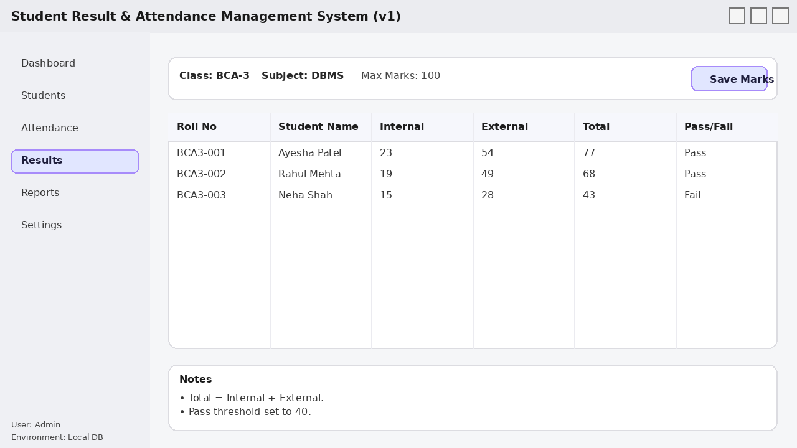

# Student Result & Attendance Management System (v1 + v2 Modernised)
**Overview**

This repository documents an academic student management system originally developed during my Bachelor of Computer Applications (BCA) degree and later modernised using current data engineering and analytics technologies.

The project demonstrates an end-to-end data lifecycle:

1. OLTP design

2. Data Quality checks

3. ETL pipeline

4. Data Warehouse modelling

5. Business Intelligence dashboards


🕒 **Project Timeline**

    🎓 Original Academic Project

    • Period: 2008 – 2009

    • Degree: Bachelor of Computer Applications (BCA), 2nd Year

    • University: Hemchandracharya North Gujarat University (HNGU), Patan

    • Location: India

    • Scope:

        • Student attendance tracking

        • Exam results management

        • Basic reporting
        
🔄 Modernisation & Analytics Reconstruction

• Period: Jan 2025

• Purpose: Learning, modernisation, and analytics portfolio

• Focus:

    • Data engineering best practices

    • BI reporting aligned with modern organisational needs

## 🛠️ Technology Stack

| Layer | Tools / Technologies |
|------|----------------------|
| Database (OLTP) | PostgreSQL |
| Data Warehouse | PostgreSQL (Star Schema) |
| ETL | Python (pandas, SQLAlchemy) |
| Data Quality | Python (Rule-based checks) |
| BI & Reporting | Power BI |
| Version Control | Git & GitHub |

This repository contains **two connected versions** of the same project:

- **v1 (BCA baseline):** a simple student administration system (students, attendance, marks, exports).
- **v2 (Data Analytics modernisation):** the same dataset modernised into a reporting platform (ETL, warehouse, data quality, Power BI + SharePoint embedding plan).

## 🎯 Component-wise Marks Enhancement (v2)

Version 2 of the system introduces **component-wise marks handling**, which significantly improves flexibility and analytical depth compared to v1.

Instead of storing a single aggregated score per subject, marks are captured and processed at a **component level**, such as:

- **Theory**
- **Practical**
- **Viva**
- **Internal Assessment**
- 

### Why this matters
- Enables **fine-grained performance analysis**
- Supports **subject-specific evaluation models**
- Allows different **weightage rules** per component
- Improves **data quality checks** at component level


### Example
For a single subject, a student’s result may consist of:

| Component | Marks Obtained | Max Marks |
|---------|----------------|-----------|
| Theory | 45 | 70 |
| Practical | 18 | 30 |
| Internal | 8 | 30 |
| Viva | 20 | 70 |

The final subject result is derived by aggregating validated component scores using defined business rules.

This enhancement is fully supported across:
- OLTP schema
- Star-schema data warehouse
- ETL pipelines
- Data Quality checks
- Power BI reporting


> **Note:** This is a portfolio repository using **synthetic / anonymised** sample data.

## Repository layout (high level)
- `v1_bca_basic_system/` — baseline application and local SQLite demo DB
- `v2_analytics_modernisation/` — ETL + warehouse + DQ + API + Docker templates
- `docs/` — documentation, Mermaid diagrams, and evidence-style logs
- `logs/sample_logs_only/` — sample run logs (ETL/DQ/API)

## Quick visuals (diagram + screenshot)

**KPI tree (Mermaid)**
- See: `docs/mermaid/kpi_tree.mmd`

If you want it to **render directly on GitHub**, paste this into README:

```mermaid
%% include the contents of docs/mermaid/kpi_tree.mmd here
```

**Results entry screen (v1 UI)**
- Screenshot: `v1_bca_basic_system/ui/screenshots/ui_05_results.png`

(Optional: embed it)
```md


## Quick start (v1)
```bash
cd v1_bca_basic_system
python -m pip install -r requirements.txt
python src/main.py
```

## Quick start (v2 ETL demo)
```bash
cd v2_analytics_modernisation
python -m pip install -r requirements.txt
python etl/run_etl.py 
python dq_data_quality/run_checks.py
```

## Important limitations (known)
- **Power BI `.pbix`** cannot be generated programmatically here. A placeholder file is provided; replace it with your real PBIX when ready.
- **Parquet outputs** are not included because Parquet writer libraries are not bundled in this environment. This template uses CSV for staged/curated outputs by default (you can switch to Parquet later by installing `pyarrow`).


## CI / GitHub Actions

This repository uses GitHub Actions for automated checks:

- **run_tests.yml**  
  Runs unit tests on every push and pull request.

- **run_dq_checks.yml**  
  Executes data quality validation rules on curated datasets.

- **run_etl_smoke.yml**  
  Performs a lightweight ETL smoke test to ensure pipelines run end-to-end.

Earlier commits include experimentation with workflows; the current setup is stable.

