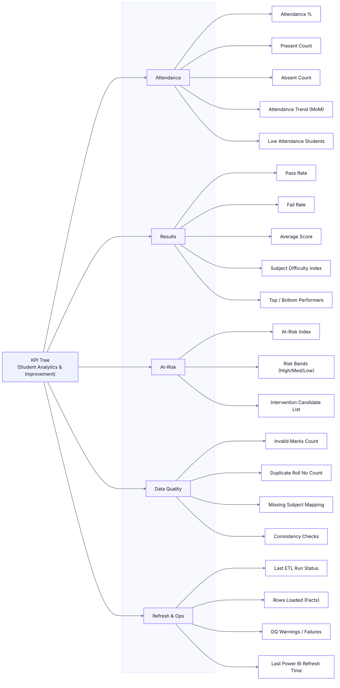

# KPI Tree

```mermaid
%%{init: {"theme":"base","flowchart":{"curve":"basis","nodeSpacing":55,"rankSpacing":150},"themeVariables":{"fontFamily":"Inter, Segoe UI, Arial","fontSize":"16px"}}}%%
flowchart LR
  classDef root fill:#EEF2FF,stroke:#A78BFA,stroke-width:2px,color:#111827;
  classDef group fill:#F5F3FF,stroke:#A78BFA,stroke-width:2px,color:#111827;
  classDef leaf fill:#FFFFFF,stroke:#A78BFA,stroke-width:2px,color:#111827;
  linkStyle default stroke:#6B7280,stroke-width:1.5px;
ROOT["KPI Tree<br/>(Student Analytics & Improvement)"]:::root

  subgraph MID[" "]
  direction TB
  A["Attendance"]:::group
  R["Results"]:::group
  AR["At-Risk"]:::group
  DQ["Data Quality"]:::group
  OPS["Refresh & Ops"]:::group
  end

  ROOT --> A
  ROOT --> R
  ROOT --> AR
  ROOT --> DQ
  ROOT --> OPS

  A --> A1["Attendance %"]:::leaf
  A --> A2["Present Count"]:::leaf
  A --> A3["Absent Count"]:::leaf
  A --> A4["Attendance Trend (MoM)"]:::leaf
  A --> A5["Low Attendance Students"]:::leaf

  R --> R1["Pass Rate"]:::leaf
  R --> R2["Fail Rate"]:::leaf
  R --> R3["Average Score"]:::leaf
  R --> R4["Subject Difficulty Index"]:::leaf
  R --> R5["Top / Bottom Performers"]:::leaf

  AR --> AR1["At-Risk Index"]:::leaf
  AR --> AR2["Risk Bands (High/Med/Low)"]:::leaf
  AR --> AR3["Intervention Candidate List"]:::leaf

  DQ --> D1["Invalid Marks Count"]:::leaf
  DQ --> D2["Duplicate Roll No Count"]:::leaf
  DQ --> D3["Missing Subject Mapping"]:::leaf
  DQ --> D4["Consistency Checks"]:::leaf

  OPS --> O1["Last ETL Run Status"]:::leaf
  OPS --> O2["Rows Loaded (Facts)"]:::leaf
  OPS --> O3["DQ Warnings / Failures"]:::leaf
  OPS --> O4["Last Power BI Refresh Time"]:::leaf
```
