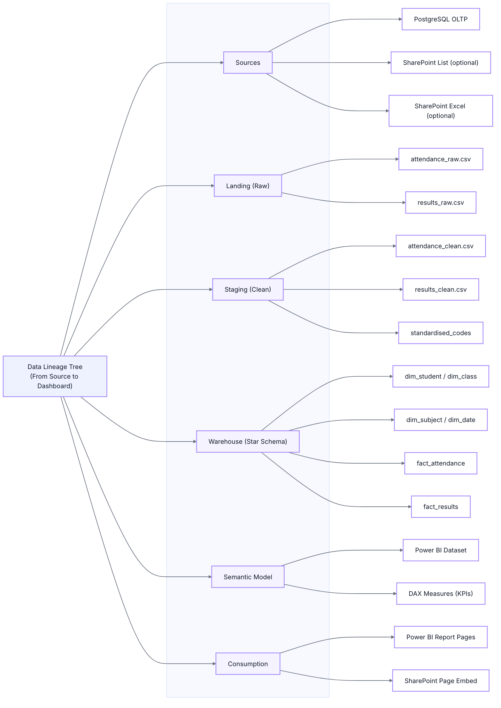

# Data Lineage Tree

```mermaid
%%{init: {"theme":"base","flowchart":{"curve":"basis","nodeSpacing":55,"rankSpacing":150},"themeVariables":{"fontFamily":"Inter, Segoe UI, Arial","fontSize":"16px"}}}%%
flowchart LR
  classDef root fill:#EEF2FF,stroke:#A78BFA,stroke-width:2px,color:#111827;
  classDef group fill:#F5F3FF,stroke:#A78BFA,stroke-width:2px,color:#111827;
  classDef leaf fill:#FFFFFF,stroke:#A78BFA,stroke-width:2px,color:#111827;
  linkStyle default stroke:#6B7280,stroke-width:1.5px;
ROOT["Data Lineage Tree<br/>(From Source to Dashboard)"]:::root

  subgraph MID[" "]
  direction TB
  S["Sources"]:::group
  LZ["Landing (Raw)"]:::group
  STG["Staging (Clean)"]:::group
  WH["Warehouse (Star Schema)"]:::group
  SM["Semantic Model"]:::group
  CON["Consumption"]:::group
  end

  ROOT --> S
  ROOT --> LZ
  ROOT --> STG
  ROOT --> WH
  ROOT --> SM
  ROOT --> CON

  S --> S1["PostgreSQL OLTP"]:::leaf
  S --> S2["SharePoint List (optional)"]:::leaf
  S --> S3["SharePoint Excel (optional)"]:::leaf

  LZ --> L1["attendance_raw.csv"]:::leaf
  LZ --> L2["results_raw.csv"]:::leaf

  STG --> T1["attendance_clean.csv"]:::leaf
  STG --> T2["results_clean.csv"]:::leaf
  STG --> T3["standardised_codes"]:::leaf

  WH --> W1["dim_student / dim_class"]:::leaf
  WH --> W2["dim_subject / dim_date"]:::leaf
  WH --> W3["fact_attendance"]:::leaf
  WH --> W4["fact_results"]:::leaf

  SM --> M1["Power BI Dataset"]:::leaf
  SM --> M2["DAX Measures (KPIs)"]:::leaf

  CON --> C1["Power BI Report Pages"]:::leaf
  CON --> C2["SharePoint Page Embed"]:::leaf
```
