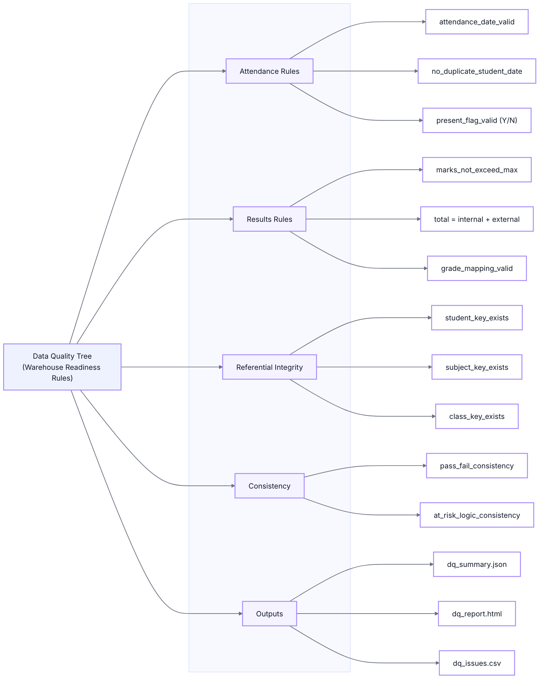

# Data Quality Tree

```mermaid
%%{init: {"theme":"base","flowchart":{"curve":"basis","nodeSpacing":55,"rankSpacing":150},"themeVariables":{"fontFamily":"Inter, Segoe UI, Arial","fontSize":"16px"}}}%%
flowchart LR
  classDef root fill:#EEF2FF,stroke:#A78BFA,stroke-width:2px,color:#111827;
  classDef group fill:#F5F3FF,stroke:#A78BFA,stroke-width:2px,color:#111827;
  classDef leaf fill:#FFFFFF,stroke:#A78BFA,stroke-width:2px,color:#111827;
  linkStyle default stroke:#6B7280,stroke-width:1.5px;
ROOT["Data Quality Tree<br/>(Warehouse Readiness Rules)"]:::root

  subgraph MID[" "]
  direction TB
  AT["Attendance Rules"]:::group
  RS["Results Rules"]:::group
  RI["Referential Integrity"]:::group
  CX["Consistency"]:::group
  OUT["Outputs"]:::group
  end

  ROOT --> AT
  ROOT --> RS
  ROOT --> RI
  ROOT --> CX
  ROOT --> OUT

  AT --> AT1["attendance_date_valid"]:::leaf
  AT --> AT2["no_duplicate_student_date"]:::leaf
  AT --> AT3["present_flag_valid (Y/N)"]:::leaf

  RS --> RS1["marks_not_exceed_max"]:::leaf
  RS --> RS2["total = internal + external"]:::leaf
  RS --> RS3["grade_mapping_valid"]:::leaf

  RI --> RI1["student_key_exists"]:::leaf
  RI --> RI2["subject_key_exists"]:::leaf
  RI --> RI3["class_key_exists"]:::leaf

  CX --> CX1["pass_fail_consistency"]:::leaf
  CX --> CX2["at_risk_logic_consistency"]:::leaf

  OUT --> O1["dq_summary.json"]:::leaf
  OUT --> O2["dq_report.html"]:::leaf
  OUT --> O3["dq_issues.csv"]:::leaf
```
