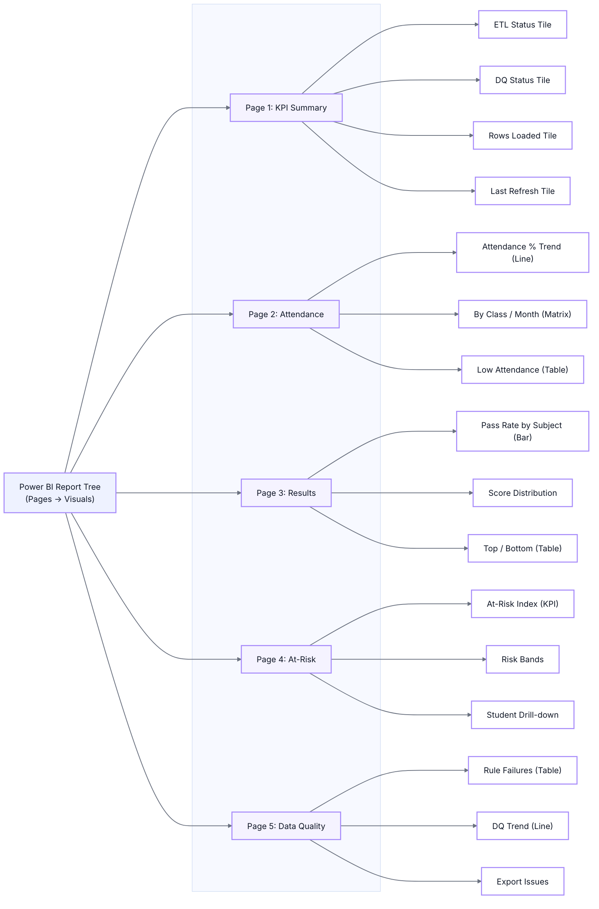

# Power BI Report Tree

```mermaid
%%{init: {"theme":"base","flowchart":{"curve":"basis","nodeSpacing":55,"rankSpacing":150},"themeVariables":{"fontFamily":"Inter, Segoe UI, Arial","fontSize":"16px"}}}%%
flowchart LR
  classDef root fill:#EEF2FF,stroke:#A78BFA,stroke-width:2px,color:#111827;
  classDef group fill:#F5F3FF,stroke:#A78BFA,stroke-width:2px,color:#111827;
  classDef leaf fill:#FFFFFF,stroke:#A78BFA,stroke-width:2px,color:#111827;
  linkStyle default stroke:#6B7280,stroke-width:1.5px;
ROOT["Power BI Report Tree<br/>(Pages → Visuals)"]:::root

  subgraph MID[" "]
  direction TB
  P1["Page 1: KPI Summary"]:::group
  P2["Page 2: Attendance"]:::group
  P3["Page 3: Results"]:::group
  P4["Page 4: At-Risk"]:::group
  P5["Page 5: Data Quality"]:::group
  end

  ROOT --> P1
  ROOT --> P2
  ROOT --> P3
  ROOT --> P4
  ROOT --> P5

  P1 --> P11["ETL Status Tile"]:::leaf
  P1 --> P12["DQ Status Tile"]:::leaf
  P1 --> P13["Rows Loaded Tile"]:::leaf
  P1 --> P14["Last Refresh Tile"]:::leaf

  P2 --> P21["Attendance % Trend (Line)"]:::leaf
  P2 --> P22["By Class / Month (Matrix)"]:::leaf
  P2 --> P23["Low Attendance (Table)"]:::leaf

  P3 --> P31["Pass Rate by Subject (Bar)"]:::leaf
  P3 --> P32["Score Distribution"]:::leaf
  P3 --> P33["Top / Bottom (Table)"]:::leaf

  P4 --> P41["At-Risk Index (KPI)"]:::leaf
  P4 --> P42["Risk Bands"]:::leaf
  P4 --> P43["Student Drill-down"]:::leaf

  P5 --> P51["Rule Failures (Table)"]:::leaf
  P5 --> P52["DQ Trend (Line)"]:::leaf
  P5 --> P53["Export Issues"]:::leaf
```
