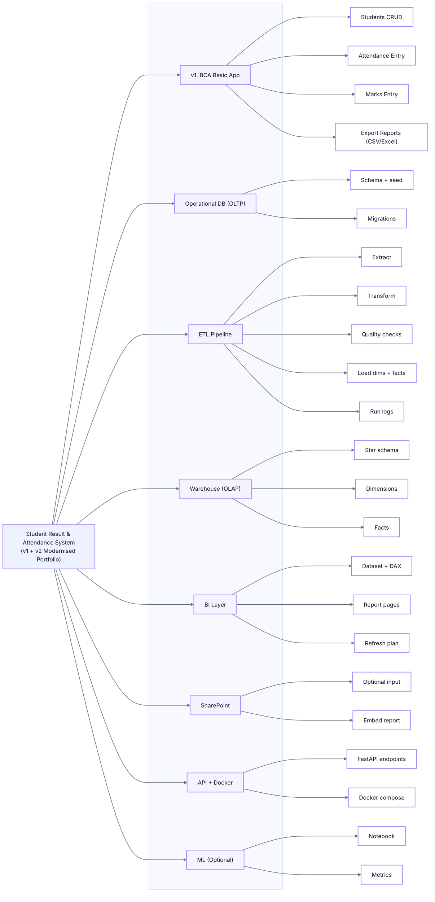

# Solution Tree

```mermaid
%%{init: {"theme":"base","flowchart":{"curve":"basis","nodeSpacing":55,"rankSpacing":150},"themeVariables":{"fontFamily":"Inter, Segoe UI, Arial","fontSize":"16px"}}}%%
flowchart LR
  classDef root fill:#EEF2FF,stroke:#A78BFA,stroke-width:2px,color:#111827;
  classDef group fill:#F5F3FF,stroke:#A78BFA,stroke-width:2px,color:#111827;
  classDef leaf fill:#FFFFFF,stroke:#A78BFA,stroke-width:2px,color:#111827;
  linkStyle default stroke:#6B7280,stroke-width:1.5px;
ROOT["Student Result & Attendance System<br/>(v1 + v2 Modernised Portfolio)"]:::root

  subgraph MID[" "]
  direction TB
  V1["v1: BCA Basic App"]:::group
  DB["Operational DB (OLTP)"]:::group
  ETL["ETL Pipeline"]:::group
  WH["Warehouse (OLAP)"]:::group
  BI["BI Layer"]:::group
  SP["SharePoint"]:::group
  API["API + Docker"]:::group
  ML["ML (Optional)"]:::group
  end

  ROOT --> V1
  ROOT --> DB
  ROOT --> ETL
  ROOT --> WH
  ROOT --> BI
  ROOT --> SP
  ROOT --> API
  ROOT --> ML

  V1 --> V11["Students CRUD"]:::leaf
  V1 --> V12["Attendance Entry"]:::leaf
  V1 --> V13["Marks Entry"]:::leaf
  V1 --> V14["Export Reports (CSV/Excel)"]:::leaf

  DB --> D1["Schema + seed"]:::leaf
  DB --> D2["Migrations"]:::leaf

  ETL --> E1["Extract"]:::leaf
  ETL --> E2["Transform"]:::leaf
  ETL --> E3["Quality checks"]:::leaf
  ETL --> E4["Load dims + facts"]:::leaf
  ETL --> E5["Run logs"]:::leaf

  WH --> W1["Star schema"]:::leaf
  WH --> W2["Dimensions"]:::leaf
  WH --> W3["Facts"]:::leaf

  BI --> B1["Dataset + DAX"]:::leaf
  BI --> B2["Report pages"]:::leaf
  BI --> B3["Refresh plan"]:::leaf

  SP --> S1["Optional input"]:::leaf
  SP --> S2["Embed report"]:::leaf

  API --> A1["FastAPI endpoints"]:::leaf
  API --> A2["Docker compose"]:::leaf

  ML --> M1["Notebook"]:::leaf
  ML --> M2["Metrics"]:::leaf
```
